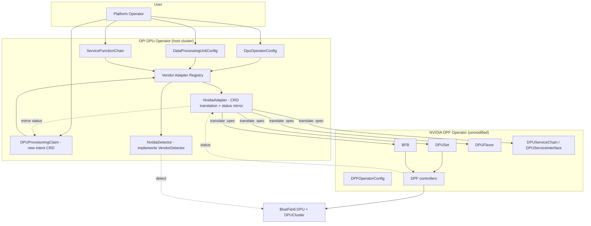
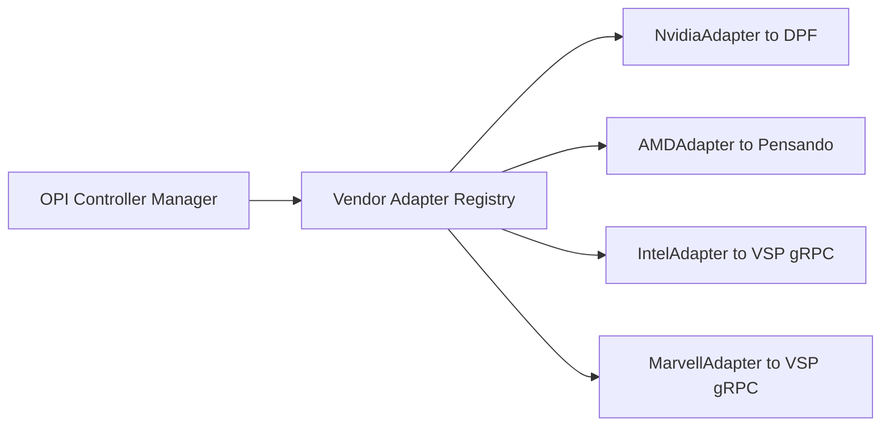
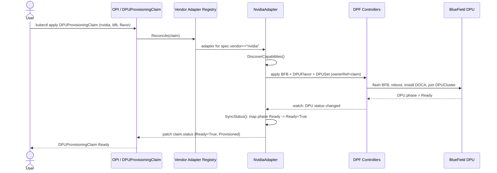
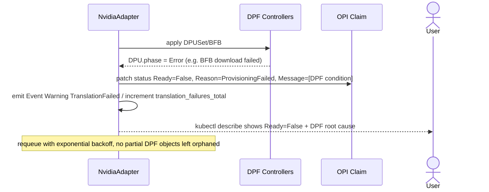
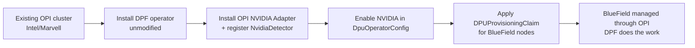
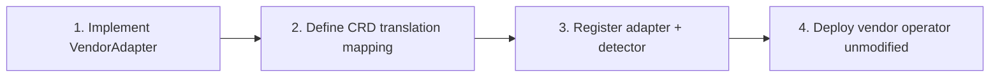

# Architecture Design — NVIDIA DPU Support in the OPI DPU Operator

**Author:** Sai Pradhyum
**Date:** 2026-07-05
**Status:** Proposal
**Scope:** Bring NVIDIA BlueField (and, by construction, AMD Pensando) DPUs under the OPI DPU
Operator while **reusing the NVIDIA DPF (DOCA Platform Framework) operator wholesale**.

---

## Table of Contents
1. [Executive Summary](#1-executive-summary)
2. [Repository Investigation (Grounding)](#2-repository-investigation-grounding)
3. [Problem Statement](#3-problem-statement)
4. [Design Constraints](#4-design-constraints)
5. [Architecture Alternatives](#5-architecture-alternatives)
6. [Trade-off Analysis](#6-trade-off-analysis)
7. [Selected Architecture](#7-selected-architecture)
8. [The OPI Vendor Adapter Framework](#8-the-opi-vendor-adapter-framework)
9. [CRD Mapping (OPI ⇄ DPF)](#9-crd-mapping-opi--dpf)
10. [Reconciliation Flow](#10-reconciliation-flow)
11. [Failure Handling](#11-failure-handling)
12. [Capability Discovery](#12-capability-discovery)
13. [Production Readiness (Observability, Security, Versioning)](#13-production-readiness)
14. [Migration Strategy](#14-migration-strategy)
15. [Future AMD Support](#15-future-amd-support)
16. [Limitations & Assumptions](#16-limitations--assumptions)
17. [Conclusion](#17-conclusion)

---

## 1. Executive Summary

The OPI DPU Operator today supports Intel and Marvell through a two-layer vendor seam: a Go
`VendorDetector` interface (control plane) and an out-of-process **gRPC VSP** (Vendor Specific
Plugin) contract (data plane). NVIDIA ships its own full-lifecycle operator, **DPF**, which owns
firmware flashing (`BFB`), hardware profiles (`DPUFlavor`), the DPU lifecycle state machine
(`DPUSet`/`DPU`), and an on-DPU tenant Kubernetes cluster (`DPUCluster`) — far more than a VSP does.

**The recommended design is a CRD-translation Adapter delivered as part of a generalized OPI
Vendor Adapter Framework.** OPI keeps ownership of *intent* (its own CRDs and node detection);
the NVIDIA adapter **translates** that intent into native DPF CRDs and **mirrors DPF status back**.
DPF remains the sole owner of BlueField provisioning. Nothing is re-implemented; ownership
boundaries stay clean; and the same framework absorbs AMD next.

**Chosen pattern:** *Delegating CRD-Translation Adapter* (Option D), registered through a new
`VendorAdapter` extension of the existing `VendorDetector` seam (Option B mechanics), explicitly
**not** embedding or forking DPF (Option C).

---

## 2. Repository Investigation (Grounding)

Full details in [`repo_analysis.md`](./repo_analysis.md). The design below is grounded in source
read from both cloned repos. The load-bearing facts:

- **OPI already exposes a vendor plug-in point** — `VendorDetector` in
  `internal/platform/vendordetector.go` with a literal `// add more detectors here` registration
  slice next to `NewIntelDetector()` / `NewMarvellDetector()`.
- **OPI's vendor data-plane contract is gRPC** (`dpu-api/api.proto`): `LifeCycleService`,
  `NetworkFunctionService`, `DeviceService`, `HeartbeatService`.
- **OPI is provisioning-light.** Its `DataProcessingUnit` CR is a thin representation; it does not
  flash firmware or manage a tenant cluster.
- **DPF is provisioning-heavy.** `DPFOperatorConfig → DPUSet → DPU (+ BFB + DPUFlavor) → DPUCluster`,
  plus `DPUService*` for dataplane. `DPU` has a real phase machine
  (`Initializing→Pending→Rebooting→Ready`, `Error`, `Deleting`).

This asymmetry is the crux: **OPI expresses intent; DPF executes lifecycle.** The adapter bridges
those two altitudes rather than pretending they are the same shape.

---

## 3. Problem Statement

> OPI supports Intel and Marvell via its VSP seam. NVIDIA BlueField is managed exclusively by the
> standalone DPF operator. An operator running mixed fleets must deploy and reason about **two
> disjoint ecosystems** with different CRDs, status models, and mental models. We want a **single
> OPI-native control surface** for the whole fleet **without re-implementing — or forking — DPF**,
> and without OPI and DPF fighting over ownership of the same BlueField hardware.

---

## 4. Design Constraints

| # | Constraint | Rationale |
|---|-----------|-----------|
| C1 | **Reuse DPF as-is** (upstream, unmodified) | DPF is NVIDIA's supported path; forking it forfeits updates, CVE fixes, and support. |
| C2 | **Kubernetes-native** | Declarative CRDs, level-triggered reconciliation, `metav1.Condition` status, owner refs, finalizers. |
| C3 | **No duplicated provisioning logic** | Firmware/flash/cluster logic lives in exactly one place (DPF). |
| C4 | **Preserve ownership boundaries** | Exactly one controller writes each object's `.spec`; DPF owns DPF CRs, OPI owns OPI CRs. No dual-writers. |
| C5 | **Extensible to future vendors** | The mechanism, not just the NVIDIA case, must generalize (AMD Pensando next). |
| C6 | **Non-invasive to OPI core** | Additive: reuse the existing detector/VSP seam; don't rewrite OPI's reconcilers. |
| C7 | **Independently deployable & versioned** | Adapter ships and upgrades on its own cadence vs. OPI and DPF. |

---

## 5. Architecture Alternatives

### Option A — Thin gRPC-VSP Adapter only
Implement an NVIDIA VSP that satisfies OPI's gRPC contract and have it drive BlueField directly.

```
OPI daemon ──gRPC──> NVIDIA VSP ──> BlueField
```
**Problem:** the VSP contract is *dataplane* (bridge ports, VFs, network functions). It has no
vocabulary for firmware `BFB`, `DPUFlavor`, or `DPUCluster`. Delivering full BlueField lifecycle
through it means **re-implementing DPF behind gRPC** — violates C1, C3.

### Option B — Sub-operator / dedicated NVIDIA controller
A first-class NVIDIA controller inside OPI.

```
OPI Operator ──> NVIDIA Controller ──> (its own provisioning)
```
Right *mechanism* (a controller registered at OPI's seam) but, taken alone, tempts re-implementing
provisioning. **Kept as the delivery mechanism, combined with D for the behavior.**

### Option C — Embed / vendor DPF source into OPI
Compile DPF controllers into the OPI binary.

```
OPI Operator [ DPF code inside ]
```
**Problem:** two controllers reconciling the same DPF CRs (split-brain), a fork to maintain, and
lockstep releases. Violates C1, C4, C7. Rejected.

### Option D — CRD Translation Layer  ✅ (selected behavior)
A controller watches OPI intent CRs and **translates** them into native DPF CRs, then mirrors DPF
status back into OPI status. DPF runs unmodified and owns its objects.

```
OPI CRDs ──> Translation Adapter ──> DPF CRDs ──> DPF controllers ──> BlueField
   ▲                                                     │
   └──────────────── status mirror ─────────────────────┘
```
Satisfies every constraint. **This is the choice**, delivered via Option B's mechanism and
generalized into a Vendor Adapter Framework (§8).

---

## 6. Trade-off Analysis

| Architecture | DPF Reuse | K8s-native | Complexity | Maintainability | Ownership clarity | Verdict |
|---|---|---|---|---|---|---|
| A — VSP-only | ❌ Low (re-impl behind gRPC) | ⚠️ partial | Medium | Low | ⚠️ blurred | Reject |
| B — Sub-operator (alone) | ⚠️ Medium | ✅ | Medium | Medium | ✅ | Partial |
| C — Embed/fork DPF | ❌ Very low | ✅ | High | ❌ Low | ❌ split-brain | Reject |
| **D — CRD Translation (via B, framework-ized)** | ✅ **High (as-is)** | ✅ | Medium | ✅ **High** | ✅ **Clean** | **Select** |
| Full rewrite | ❌ Very low | ✅ | Very high | ❌ Low | ✅ | Reject |

**Decision:** **Option D**, delivered as a registered adapter through Option B's mechanism and
generalized into the OPI Vendor Adapter Framework (§8). Highest reuse, cleanest ownership,
moderate and well-contained complexity (the translation map itself is the only real risk, §16).

### 6.1 Why not own DPF's job? (rejected alternatives, explicit)

The design deliberately refuses to take over any work DPF already does. The three tempting shortcuts
and why each is wrong:

| Rejected approach | Why rejected |
|---|---|
| **Embed DPF** (compile DPF controllers into OPI) | Tight coupling + split-brain: two controllers reconcile the same DPF CRs. Violates single-writer ownership (C4). |
| **Fork DPF** (vendor a copy, patch it) | Upstream divergence: you inherit a permanent merge burden and lose NVIDIA's CVE/support stream. Violates reuse-as-is (C1). |
| **Reimplement DPF** (rebuild flash/boot/DOCA/cluster behind a VSP) | High maintenance + duplicated provisioning logic; re-solves a hard problem NVIDIA already solved. Violates C1, C3. |

The adapter instead treats DPF as an unmodified, upstream dependency and only *translates intent into*
DPF's own CRDs — the one approach that keeps DPF replaceable and independently upgradable (C7).

---

## 7. Selected Architecture

Two planes, mirroring OPI's own two-layer seam:

- **Control plane (new):** an `NvidiaAdapter` registered in OPI's controller manager. It reconciles
  OPI intent (`DataProcessingUnitConfig`, `ServiceFunctionChain`, and a small new
  `DPUProvisioningClaim` intent) into DPF CRs (`DPUSet`, `BFB`, `DPUFlavor`, `DPUServiceChain`, …)
  and mirrors DPF status back. **DPF is never modified.**
- **Node plane (reuse):** an `NvidiaDetector` implementing the existing `VendorDetector` interface so
  BlueField devices are detected and surfaced as `DataProcessingUnit` CRs exactly like Intel/Marvell.
  Dataplane parity (bridge ports / VFs / network functions) is served through the existing gRPC VSP
  contract, backed by DOCA/OVS on the DPU.



**Ownership rule (C4):** the adapter writes **only** the `.spec` of DPF CRs it creates (with an OPI
owner reference) and writes **only** the `.status` of OPI CRs. It never writes DPF `.status` and DPF
never writes OPI objects. One writer per field, always.

---

## 8. The OPI Vendor Adapter Framework

Rather than a one-off NVIDIA adapter, we generalize the existing seam into a first-class framework
so every vendor — including the current Intel/Marvell VSP path — is expressible uniformly.



The framework contract (full Go in [`feature_skeleton.go`](./feature_skeleton.go)):

```go
type VendorAdapter interface {
    // Identity — reuses the vocabulary of the existing VendorDetector seam.
    Name() string

    // DiscoverCapabilities probes what this DPU model actually supports.
    DiscoverCapabilities(ctx context.Context, dpu DPURef) (Capability, error)

    // Translate maps OPI intent into vendor-native desired state (e.g. DPF CRs).
    Translate(ctx context.Context, intent OPIIntent) ([]VendorObject, error)

    // SyncStatus mirrors vendor-native status back onto OPI CR conditions.
    SyncStatus(ctx context.Context, intent OPIIntent) (OPIStatus, error)
}
```

- **NVIDIA** implements `Translate`/`SyncStatus` as DPF-CRD apply/mirror.
- **Intel/Marvell** implement them as thin pass-throughs over the existing gRPC VSP.
- **AMD** slots in later with no framework change (§15).

This is the differentiator: the deliverable is not "an NVIDIA hack," it is **the shape OPI grows a
long-term multi-vendor story into**, with NVIDIA as the first, hardest proof.

---

## 9. CRD Mapping (OPI ⇄ DPF)

| OPI intent (owned by OPI) | DPF target (owned by DPF) | Direction | Notes |
|---|---|---|---|
| `DpuOperatorConfig` (enable NVIDIA) | `DPFOperatorConfig` | OPI → DPF | Adapter ensures DPF is installed/enabled; does not manage DPF internals. |
| `DPUProvisioningClaim` *(new)* → `bfbURL`, `flavor`, `nodeSelector` | `BFB` + `DPUFlavor` + `DPUSet` | OPI → DPF (spec) | Firmware/profile/desired-set translation. |
| `DataProcessingUnit` (per-device) | `DPU` | DPF → OPI (status) | Mirror `DPU` phase → `DataProcessingUnit` `Ready` condition. |
| `ServiceFunctionChain` | `DPUServiceChain` (+ `DPUServiceInterface`) | OPI → DPF (spec) | Chain-of-functions translation. |
| — | `DPUCluster` (Kamaji tenant) | DPF-internal | Not surfaced through OPI (v1); referenced read-only in status. |

**Status mapping** (`DPU.status.phase` → OPI `Ready` condition):

| DPF phase | OPI `Ready` | Reason |
|---|---|---|
| `Initializing` / `Pending` | `False` | `Provisioning` |
| `Rebooting` / `DPUWarmReboot` | `False` | `Rebooting` |
| `Ready` | `True` | `Provisioned` |
| `Error` | `False` | `ProvisioningFailed` |
| `Deleting` | `False` | `Deprovisioning` |

---

## 10. Reconciliation Flow

Happy path — provisioning a BlueField through OPI:



The adapter **watches** the DPF `DPU`/`DPUSet` objects it owns (owner-ref driven), so status mirroring
is event-driven and level-triggered — re-running `Reconcile` from scratch always converges.

## 11. Failure Handling



Failure principles:
- **Never swallow DPF errors** — surface the DPF condition verbatim into the OPI `Message`.
- **Idempotent translation** — re-apply is a no-op when desired == actual (server-side apply / patch).
- **Finalizer-driven cleanup** — a finalizer on the OPI claim guarantees owned DPF CRs are deleted
  before the claim is removed (owner refs also cascade). No orphaned `DPUSet`/`BFB`.
- **Backoff + requeue** on transient errors; terminal DPF `Error` is reflected, not retried forever.

---

## 12. Capability Discovery

Not every DPU model supports every offload. The adapter probes capability before translating, so
OPI can reject impossible intent early and expose an accurate fleet inventory.

```go
type Capability struct {
    RDMA        bool
    VDPA        bool
    OVSOffload  bool
    IPsec       bool
    StorageOffload bool
    SFCChaining bool
}
```

- Sources: DPF `DPUFlavor` / `DPUDevice` fields, DOCA feature reports, and (for VSP vendors) the
  gRPC `DeviceService`.
- Surfaced on `DataProcessingUnit.status.capabilities` for `kubectl`-visible fleet inventory.
- Used as an **admission gate**: e.g. a `ServiceFunctionChain` needing IPsec offload is rejected on
  a model where `Capability.IPsec == false`, with a clear condition instead of a silent runtime failure.

## 13. Production Readiness

**Observability**
- Metrics (Prometheus): `opi_adapter_translation_requests_total{vendor}`,
  `opi_adapter_translation_failures_total{vendor,reason}`,
  `opi_adapter_reconcile_latency_seconds` (histogram),
  `opi_adapter_managed_dpus{vendor,phase}` (gauge).
- Events: `Normal TranslationSucceeded`, `Warning TranslationFailed` on the OPI intent object.
- Structured logging (`logr`/zap): every log line carries `vendor`, `claim`, `dpuSet`, `phase`.
- Health probes: `/livez` (manager alive), `/readyz` (DPF CRDs present, informers synced).

**Security**
- **RBAC least privilege:** the adapter gets `create/update/patch/delete` **only** on the DPF CR
  groups it translates (`provisioning.dpu.nvidia.com`, `svc.dpu.nvidia.com`) and `status` on its own
  OPI CRs — never cluster-admin.
- **Namespace isolation:** adapter runs in the OPI operator namespace; DPF stays in its own; tenant
  `DPUCluster` kubeconfigs are treated as secrets, never logged.
- **Secret handling:** BFB registry creds / DPUCluster kubeconfig referenced by `SecretRef`, mounted
  read-only, excluded from status and events.
- **Supply chain:** adapter image signed; DPF pulled from NVIDIA's published, unmodified release.

**Version compatibility** (adapter is the compatibility contract between the two):

| OPI Operator | Adapter | DPF | Status |
|---|---|---|---|
| 1.0.x | 1.0.x | 25.x (`v1alpha1`) | Supported |
| 1.1.x | 1.1.x | 25.x–26.x | Supported |
| 1.1.x | 1.0.x | 26.x | ⚠️ Degraded — pin adapter to DPF minor |

The adapter pins the DPF API version it translates against and fails **closed** with a clear
condition if it detects an unknown DPF CRD version, rather than mis-translating.

## 14. Migration Strategy



- **Additive & reversible:** removing the adapter leaves DPF (and any directly-created DPF CRs)
  intact. Brownfield DPF users can adopt OPI incrementally.
- **Adoption of existing DPF objects:** the adapter can run in an "observe-only" mode first (mirror
  status without owning) before taking ownership, de-risking rollout on live fleets.

## 15. Future AMD Support

AMD Pensando plugs into the **same** `VendorAdapter` interface (§8): implement `Name()="amd"`,
`Translate()` (to Pensando's CRDs/API), `SyncStatus()`, `DiscoverCapabilities()`, register an
`AMDDetector`. No change to the registry, OPI intent CRDs, or the NVIDIA adapter — which is precisely
the payoff of framework-izing instead of hard-coding NVIDIA.

### 15.1 Future Vendor Onboarding (the reusable recipe)

Onboarding any new vendor `X` is a fixed, four-step recipe — no core OPI changes:

| Step | Action | Artifact |
|---|---|---|
| 1 | Implement the `VendorAdapter` interface for `X` | `XAdapter` (Go type) |
| 2 | Define the CRD/API translation mapping (OPI intent → `X`-native objects) + status mirror | `Translate()` / `SyncStatus()` |
| 3 | Register the adapter (and an `XDetector` in the `// add more detectors here` slice) | one line in the registry |
| 4 | Deploy the vendor's operator/agent (unmodified) alongside OPI | Helm/manifests |



Because steps 1–3 touch only the new vendor's own code and a single registration line, and step 4
reuses the vendor's upstream operator, onboarding is **additive and isolated** — the core promise of
the framework.

## 16. Limitations & Assumptions

- **Translation fidelity is the main risk.** OPI intent is coarser than DPF's rich model; some DPF
  capabilities (advanced `DPUFlavor` tuning, direct `DPUCluster`/tenant workloads) are **not**
  expressible through OPI v1 and remain DPF-direct. The adapter deliberately covers the common 80%.
- **`DPUProvisioningClaim` is a proposed new OPI CRD**, not present upstream today; it is the minimal
  intent surface for firmware+flavor+selector. (Assumption pending OPI community review.)
- **DPF API is `v1alpha1`** and can change; the adapter pins a version and fails closed on mismatch.
- **`DPUCluster` (tenant K8s) is out of scope for v1** surfacing — referenced read-only in status.
- Skeleton in `feature_skeleton.go` is illustrative (compiles, not wired to live clusters); it uses
  local stand-in types clearly mapped to `controller-runtime` + the OPI/DPF apis (see file header).
- CRD group names for DPF (`*.dpu.nvidia.com`) reflect the repo's layout; exact group strings should
  be re-pinned to the target DPF release at implementation time.

## 17. Conclusion

OPI is already a vendor framework; NVIDIA is simply the first vendor whose stack is *itself* a full
operator. The right move is not to shrink DPF into a VSP, nor to fork it, but to **let OPI express
intent and let DPF execute lifecycle**, joined by a thin, well-bounded **CRD-translation adapter**
that is one instance of a generalized **Vendor Adapter Framework**. This maximizes reuse (DPF runs
unmodified), stays strictly Kubernetes-native, keeps ownership boundaries clean, and — because the
seam is generalized — makes AMD and every future vendor a registration, not a redesign.
